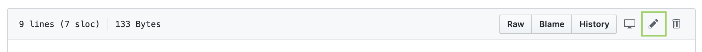
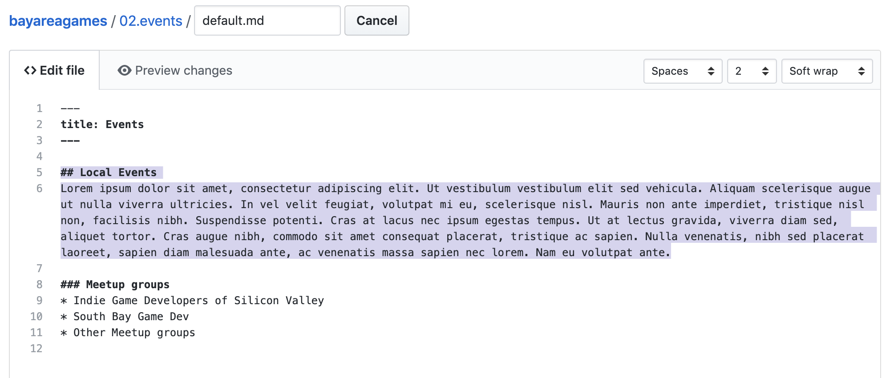
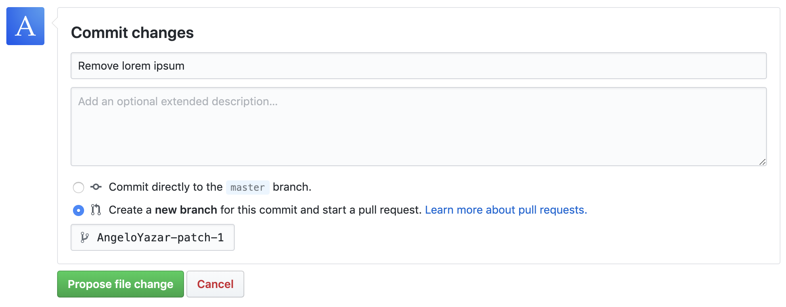
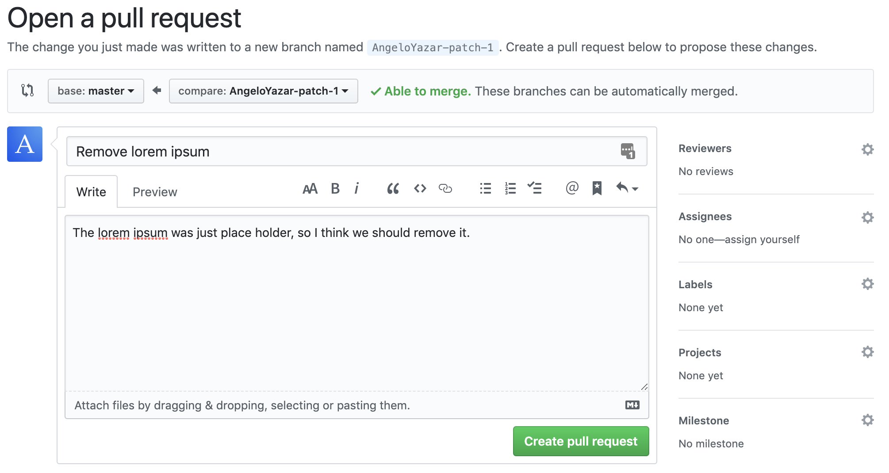

# Contributing

The mission of Bay Area Games is to **help game developers in the Bay Area connect, learn & self promote.**
This site is intended to be developed by the community itself, and the more voices we have the more valuable the site will become for everyone, so we encourage you to contribute!

## How to Contribute

The contents of the site are hosted on [github](https://github.com/bayareagames/bayareagames), and is formatted using [Markdown](https://learn.getgrav.org/16/content/markdown).
This makes it easy for anyone to make changes to the site while having every change tracked, reviewed and approved by moderators.

You don't need to master git to edit this site, GitHub makes it easy to make changes directly on their site.
The steps to suggest a change are as follows:
- Make a [GitHub Account](https://github.com/join)

- Go to the [repository for this site](https://github.com/bayareagames/bayareagames)

- Navigate to the page you'd like to edit, for instance the [events page.](https://github.com/AngeloYazar/bayareagames/blob/master/02.events/default.md)

- Click the 'Edit this file' button that looks like a pencil

- Edit the page to your heart's content, previewing with GitHub's 'Preview changes' tab

- When you're done, at the bottom of the page describe your changes in the 'Commit changes' area and click the 'Propose file change' button

- On the next screen describe the motivation for your change if applicable, and hit the 'Create pull request' button

- A moderator will then be able review your request, and either accept the changes, request edits or reject the changes.

- If your changes are accepted and merged, the site will automatically update itself to reflect them!

## What to Contribute

* The best changes are one that have the potential to help other game developers.
* Formatting, spelling grammar etc are okay too
* Self promotion is encouraged in moderation, a single entry for each game making entity with a backstory and links to portfolio sites is great. We don't have good examples yet, but when we do we should update this note :)

Please note we have a code of conduct, please follow it in all your interactions with the project.

## Code of Conduct

### Our Pledge

In the interest of fostering an open and welcoming environment, we as
contributors and maintainers pledge to making participation in our project and
our community a harassment-free experience for everyone, regardless of age, body
size, disability, ethnicity, gender identity and expression, level of experience,
nationality, personal appearance, race, religion, or sexual identity and
orientation.

### Our Standards

Examples of behavior that contributes to creating a positive environment
include:

* Using welcoming and inclusive language
* Being respectful of differing viewpoints and experiences
* Gracefully accepting constructive criticism
* Focusing on what is best for the community
* Showing empathy towards other community members

Examples of unacceptable behavior by participants include:

* The use of sexualized language or imagery and unwelcome sexual attention or
advances
* Trolling, insulting/derogatory comments, and personal or political attacks
* Public or private harassment
* Publishing others' private information, such as a physical or electronic
  address, without explicit permission
* Other conduct which could reasonably be considered inappropriate in a
  professional setting

### Our Responsibilities

Project maintainers are responsible for clarifying the standards of acceptable
behavior and are expected to take appropriate and fair corrective action in
response to any instances of unacceptable behavior.

Project maintainers have the right and responsibility to remove, edit, or
reject comments, commits, code, wiki edits, issues, and other contributions
that are not aligned to this Code of Conduct, or to ban temporarily or
permanently any contributor for other behaviors that they deem inappropriate,
threatening, offensive, or harmful.

### Scope

This Code of Conduct applies both within project spaces and in public spaces
when an individual is representing the project or its community. Examples of
representing a project or community include using an official project e-mail
address, posting via an official social media account, or acting as an appointed
representative at an online or offline event. Representation of a project may be
further defined and clarified by project maintainers.

### Enforcement

Instances of abusive, harassing, or otherwise unacceptable behavior may be
reported by contacting the project team at admin@bayarea.games. All
complaints will be reviewed and investigated and will result in a response that
is deemed necessary and appropriate to the circumstances. The project team is
obligated to maintain confidentiality with regard to the reporter of an incident.
Further details of specific enforcement policies may be posted separately.

Project maintainers who do not follow or enforce the Code of Conduct in good
faith may face temporary or permanent repercussions as determined by other
members of the project's leadership.

### Attribution

This Code of Conduct is adapted from [this gist](https://gist.github.com/PurpleBooth/b24679402957c63ec426) which itself was adapted from the [Contributor Covenant][homepage], version 1.4,
available at [http://contributor-covenant.org/version/1/4][version]

[homepage]: http://contributor-covenant.org
[version]: http://contributor-covenant.org/version/1/4/
